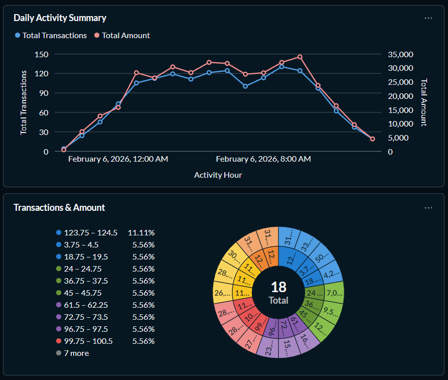
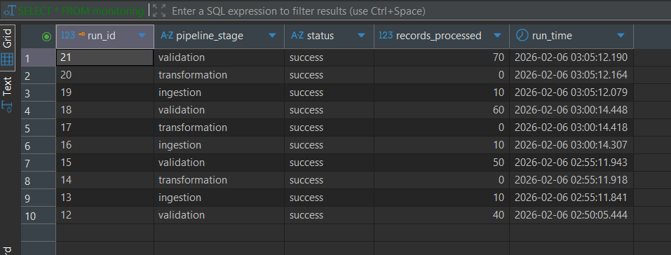

# Self-Hosted Transactional Data Pipeline

This project demonstrates a production-style, automated data pipeline that ingests transactional data, transforms it into analytical models, validates results, and visualizes metrics in a dashboard. The system is fully self-hosted, containerized, and scheduled to simulate a real-world batch data engineering workflow.

---

## Tech Stack

- **Python** – ingestion, transformation, and validation scripts  
- **PostgreSQL** – transactional and analytical data storage  
- **Docker** – containerized pipeline execution  
- **TrueNAS Cron** – automated scheduling  
- **Metabase** – dashboard and data visualization  



---

## Project Goals

- End-to-end data pipeline design  
- SQL-based analytical transformations  
- Automated batch processing  
- Data validation and monitoring  
- Containerized deployment  
- Self-hosted data infrastructure  

---

## Pipeline Stages

### 1. Ingestion
- Generates synthetic transaction data  
- Inserts events into: `raw_data.transactions`  
- Logs ingestion status into: `monitoring.pipeline_runs`  

### 2. Transformation
- Aggregates raw transactions into hourly metrics  
- Writes results into: `analytics.hourly_activity_summary`  


### 3. Validation
- Checks raw and analytics tables  
- Detects pipeline failures  
- Logs validation status into: `monitoring.pipeline_runs`  



## Database Structure

- **raw_data** – source-level transactional data (`accounts`, `transactions`)  
- **analytics** – aggregated business-ready datasets (`hourly_activity_summary`)  
- **monitoring** – pipeline execution logs (`pipeline_runs`)  

---

## Pipeline Monitoring

- Each stage logs execution status  
- Enables health tracking, run history, and failure detection  

Example query:

```sql
SELECT *
FROM monitoring.pipeline_runs
ORDER BY run_id DESC
LIMIT 10;
